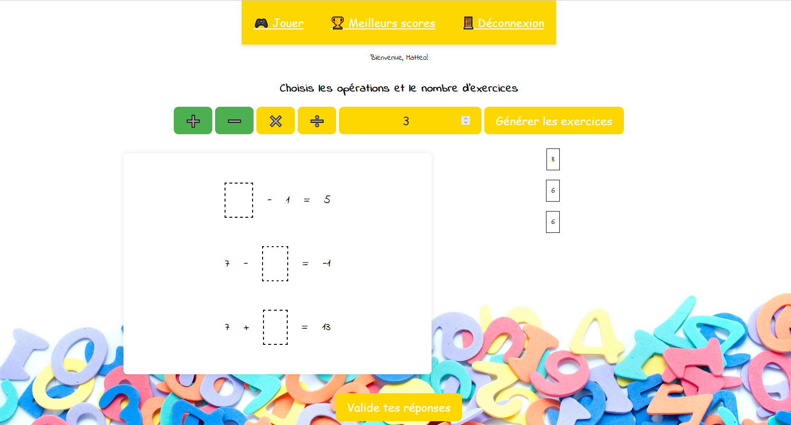

# Calculus 🧮

## Introduction 👋
Bienvenue dans **Calculus**, une application web amusante et interactive qui aide les enfants de 6 à 8 ans à améliorer leurs compétences en calcul ! Tu pourras t'amuser avec des exercices de calcul tout en apprenant. 

## Comment jouer ? 🎮
- __Entrez ton prénom__ : D'abord, tape ton prénom pour commencer l'aventure. Nous serons contents de te connaître !
- __Choisis tes défis__ : Sélectionne le type de calcul que tu souhaites pratiquer (addition, soustraction, multiplication ou division) et choisis le nombre maximum avec lequel tu veux t'amuser.
- __Résous les énigmes__ : L'application te proposera des exercices amusants en fonction de tes choix. Clique sur les réponses et fais-les glisser à la bonne place !
- __Vérifie tes réponses__ : Une fois que tu as terminé, envoie tes réponses. Les bonnes réponses s'afficheront en vert et les erreurs en rouge pour que tu puisses voir où tu t'es amélioré.
- __Découvre les meilleurs scores__ : Jette un coup d'œil aux 10 meilleurs scores pour voir comment tu te compares avec les autres champions de calcul !

Prêt à relever le défi et à devenir un super héros des maths ? 🎉🚀

