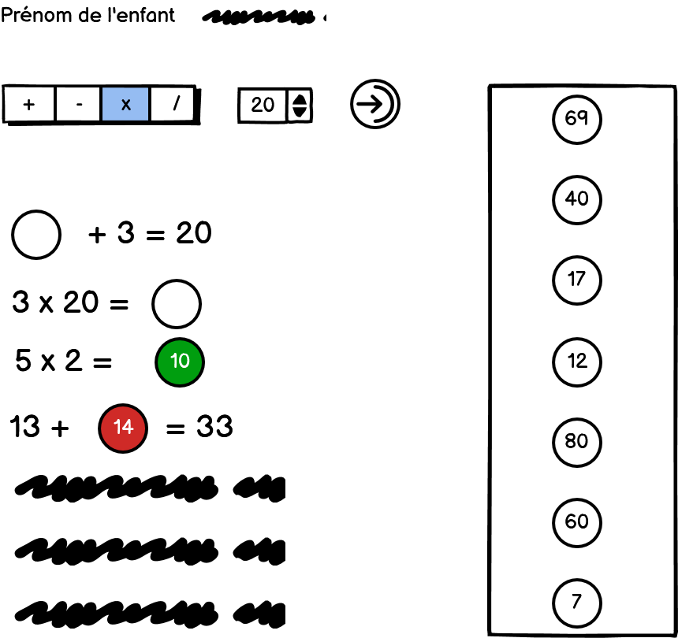
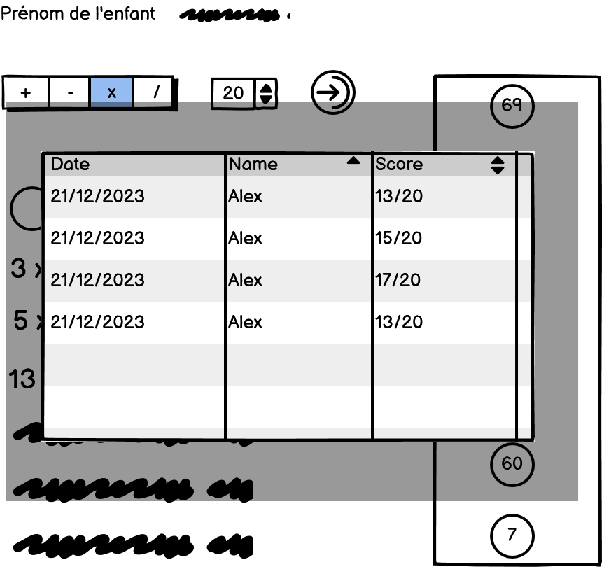

# Plateforme d'Apprentissage Mathématique Interactif pour Enfants

## Description détaillée
L'ambition de ce projet est de construire une application web ludique et interactive pour aider les enfants de 6 à 8 ans à renforcer leurs compétences en calcul. Cette application web doit être conçue de manière à engager les enfants dans une variété d'exercices de calcul, tout en fournissant un feedback constructif.

Au lancement de l'application, un enfant est invité à entrer son nom. Ce nom, ainsi que le score de l'enfant, seront enregistrés pour une session ultérieure, afin de suivre les progrès de l'enfant sur une période. Pour cela, il faut concevoir et implémenter une base de données, ainsi que développer une API pour interagir avec cette base de données. Les appels à l'API seront effectués en utilisant la méthode `fetch`.

L'interface principale de l'application permettra à l'enfant de sélectionner le type d'opérations mathématiques (addition, soustraction, multiplication, division) qu'il souhaite pratiquer, ainsi que la borne supérieure pour le résultat des exercices proposés. Sur la base de ces sélections, l'application générera une série de 10 exercices adaptés.

Pour répondre aux exercices, l'enfant devra choisir parmi un ensemble de réponses possibles et les placer au bon endroit grâce à une fonctionnalité de glisser-déposer. Une fois les réponses soumises, l'application corrigera automatiquement les réponses, mettant en évidence les bonnes réponses en vert et les erreurs en rouge.

En outre, l'application doit inclure une page présentant un tableau des 10 meilleurs scores obtenus par les enfants, afin de promouvoir un environnement compétitif mais amusant.

## Mocks
Ci-dessous des mocks représentant la demande. Le visuel est laissé à votre appréciation et ne doit pas chercher à suivre les mocks.

## Points clés
- Conception et développement d'une base de données pour stocker les noms et les scores des enfants.
- Création d'une API pour l'interaction avec la base de données.
- Utilisation de fetch pour les appels à l'API.
- Conception d'une interface utilisateur adaptée aux enfants de 6 à 8 ans.
- Mise en œuvre de la logique du jeu en JavaScript.
- Utilisation de la fonctionnalité de glisser-déposer pour soumettre les réponses.
- Correction automatique des réponses avec un feedback visuel (bonnes réponses en vert, erreurs en rouge).
- Mise en place d'une fonctionnalité de score.
- Création d'une page pour afficher un tableau des 10 meilleurs scores.
- Documentation claire et complète du code.

## Date limite de dépôt :  31/08/2024
L'évaluation de ce projet sera basée sur la mise en œuvre efficace des points clés énumérés ci-dessus, l'ergonomie, la fiabilité et la pertinence de l'application pour le public cible.
